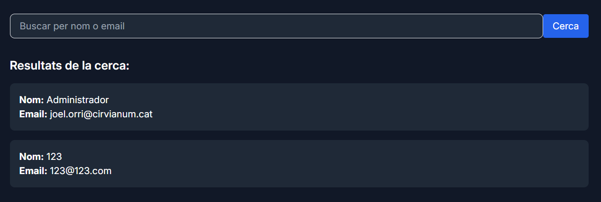
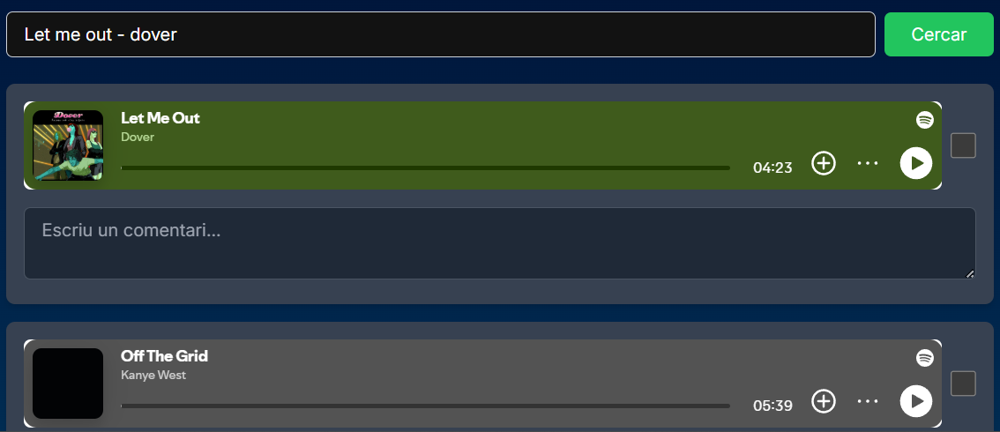
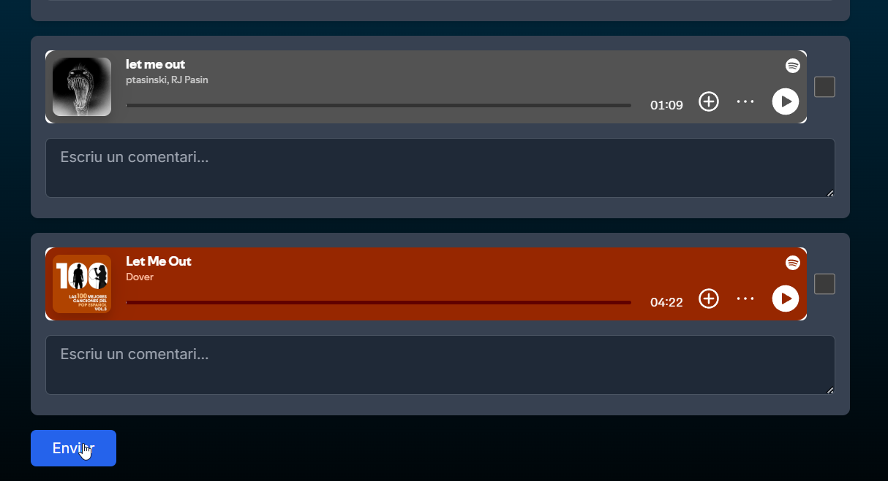
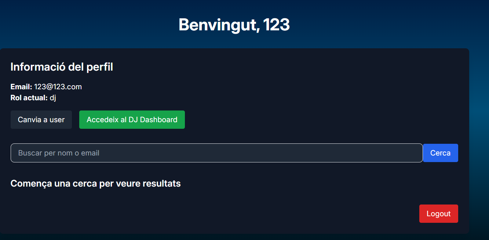
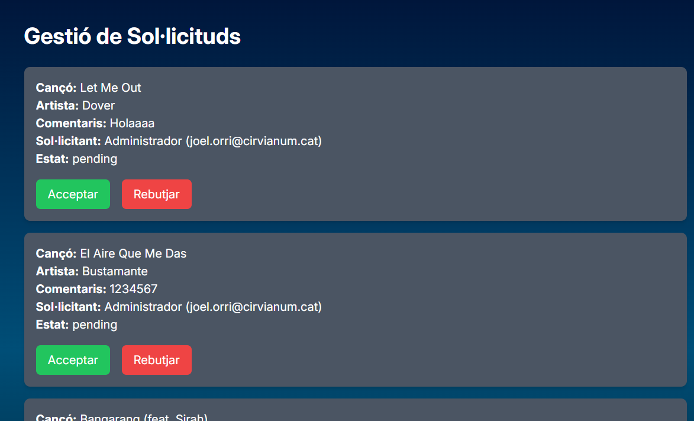
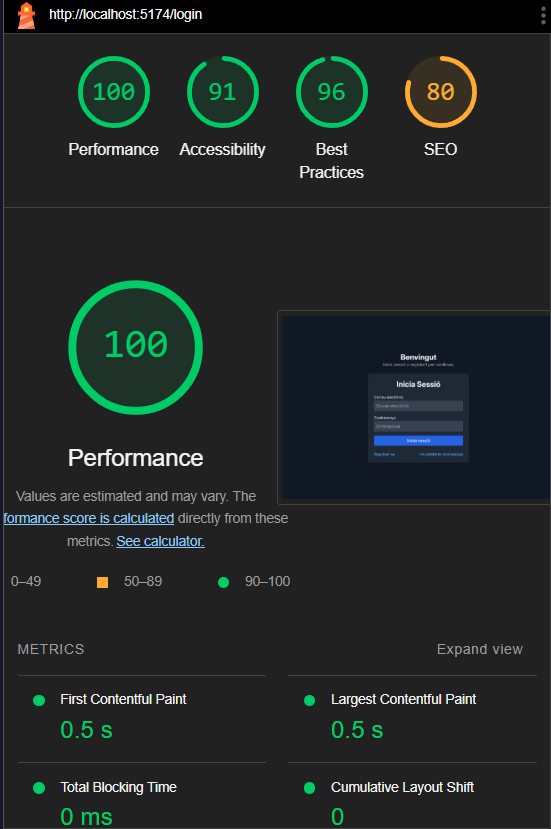
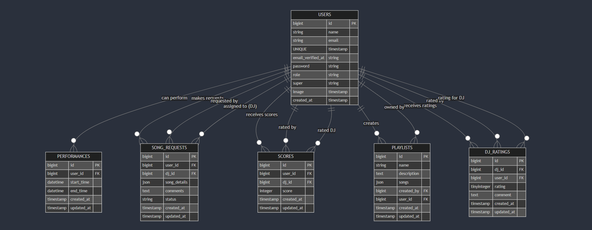

## Avaluació d'Accessibilitat i Usabilitat en el Desenvolupament Web\*\*

L'accessibilitat i la usabilitat són dos pilars fonamentals del disseny web. Assegurar que una aplicació sigui accessible significa garantir que totes les persones, incloent-hi aquelles amb discapacitats, puguin accedir-hi i fer-la servir fàcilment. Per altra banda, la usabilitat permet que l'experiència de l'usuari sigui intuïtiva i satisfactòria.

En aquest exercici, avaluareu l'accessibilitat i la usabilitat de la vostra aplicació web desenvolupada amb Remix, identificant possibles millores i proposant canvis basats en proves amb usuaris.

---

### **Objectius**

1. Identificar problemes d'accessibilitat i usabilitat en l'aplicació web.
2. Dur a terme proves d'usabilitat amb usuaris reals.
3. Analitzar els resultats i proposar millores concretes.

---

### **Fases de l'activitat**

#### 1. Preparació

**Tasques a Provar:**

Definiu 3 accions bàsiques que un usuari hauria de poder realitzar a l'aplicació, com ara:

1. **Registrar una despesa nova:**

   - Primer buscarem un DJ des del buscador. Podem entrar un nom o deixar la consulta buida per obtenir tots els usuaris amb rol DJ. 
     
      

   - Buscarem una cançó mitjançant el buscador existent que apareix quan ja hem seleccionat un DJ. 
     
      
   - Seleccionarem una opció i clicarem "Enviar", que està al final del fitxer. 
      

2. **Consultar l'estadística d'una categoria específica:**

   - Visualitzarem la consulta que acabem de fer per part del DJ, això ho podrem veure des del botó d'**Accedeix al DJ Dashboard**.
      
     
      
   - Si accedim al DJ Dashboard, veurem una interfície per gestionar les sol·licituds.ç
      
     
      
   - Es mostraran exemples de consultes denegades, acceptades i processades pel DJ.

3. **Navegar fàcilment per la pàgina:**
   - La navegacio per la pagina es intuitiva, i senzilla

**Verificació d'Accessibilitat:**

- Feu servir eines com Wave o l'eina d'auditoria d'accessibilitat de Chrome DevTools per identificar problemes tècnics d'accessibilitat (e.g., contrast de colors, etiquetes ARIA, etc.).

---

#### 2. Realització de Proves amb Usuaris

**Selecció d'Usuaris:**

- Trieu 3 persones que no estiguin familiaritzades amb l'aplicació.
- Consell: Busqueu persones amb diferents nivells d'experiència amb la tecnologia per obtenir diverses perspectives.

**Execució de les Proves:**

Demaneu als usuaris que completin les tasques definides mentre observeu:

- Quant de temps triguen.
- Dificultats o errors que experimenten.
- Reaccions verbals o no verbals (e.g., confusió, frustració).

**Observacions dels Usuaris:**

1. **Persona 1 (70 anys):**

   - No ha sabut reaccionar correctament al funcionament de l'aplicació. Tot i que ha aconseguit penjar una cançó, no ha sabut crear una llista de reproducció.
   - La dificultat percebuda ha estat mitjana-alta.
   - No ha experimentat frustració, però sí una certa incertesa.

2. **Persona 2 (20 anys):**

   - Ha entès perfectament el funcionament de l'aplicació i no ha tingut cap problema en fer-la servir.
   - No ha percebut cap dificultat ni confusió.

3. **Persona 3 (45 anys):**
   - Ha entès el funcionament general de l'aplicació, però ha tingut alguns problemes puntuals.
   - Hi ha hagut confusió a l'hora d'utilitzar la funció de cerca de DJs, i ha estat necessari guiar-la per completar el procés.

---

#### 3. Anàlisi i Proposta de Millores

**Resum dels Resultats:**

Incloeu un document anomenat `accessibilitat-i-usabilitat.md` al vostre projecte. Ha de contenir:

**Observacions durant les proves:**

- Persona 1 (70 anys): S'ha detectat la necessitat d'un disseny més intuïtiu i funcionalitats bàsiques més visibles.
- Persona 2 (20 anys): No s'han detectat problemes.
- Persona 3 (45 anys): Confusió en el context d'algunes funcionalitats, com la cerca de DJs.

**Problemes Identificats (amb prioritat alta, mitjana o baixa):**

- **Absència del botó de "logout" al navbar (Prioritat alta):** La manca d'aquest botó afecta la percepció de control sobre la sessió activa.
- **Dificultat per crear llistes de reproducció (Prioritat mitjana):** Alguns usuaris no identifiquen clarament com crear-les.
- **Confusió en la funció de cerca de DJs (Prioritat mitjana):** Cal millorar el context de navegació.

**Feedback recollit dels usuaris:**

- Persona 1 (70 anys): Suggeriments per fer l'aplicació més intuïtiva, com un menú més clar.
- Persona 2 (20 anys): No es van recollir suggeriments.
- Persona 3 (45 anys): Es va suggerir afegir guies visuals i simplificar el procés de cerca.

**Propostes de Millora:**

1. **Accessibilitat:**

   - Ajustar el contrast i afegir etiquetes descriptives.
   - Incorporar etiquetes ARIA per millorar l'experiència d'usuaris amb discapacitats.

2. **Usabilitat:**
   - Afegir un botó de "logout" visible al navbar.
   - Simplificar la navegació en funcions com la cerca de DJs.
   - Millorar els formularis amb indicacions visuals.

---

#### 4. Implementació

Si teniu temps, implementeu algunes de les millores proposades i repetiu el cicle de proves per validar els canvis.

---

### **Lliurables**

1. Documentació completa amb:
   - Llista de tasques provades.
   - Observacions i problemes identificats.
   - Feedback i propostes de millora.
2. Justificació de les millores implementades i beneficis obtinguts.

Aquest document proporciona una guia clara per millorar l'accessibilitat i usabilitat de l'aplicació web.

